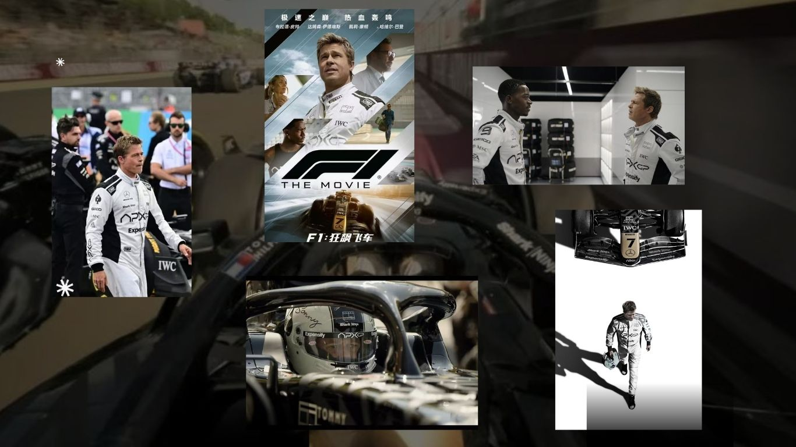
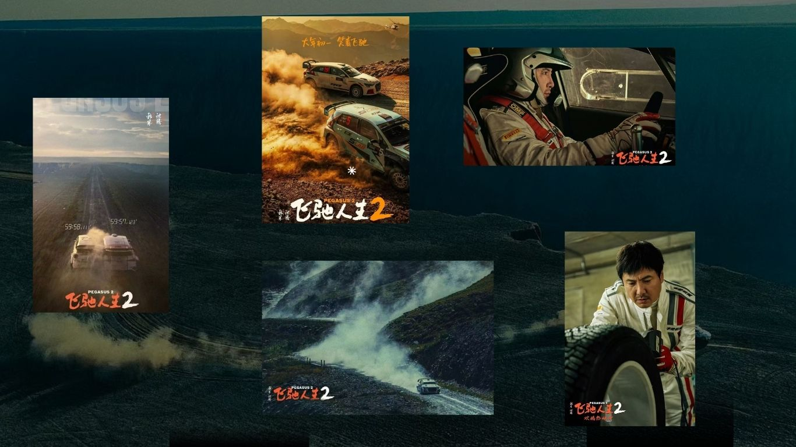
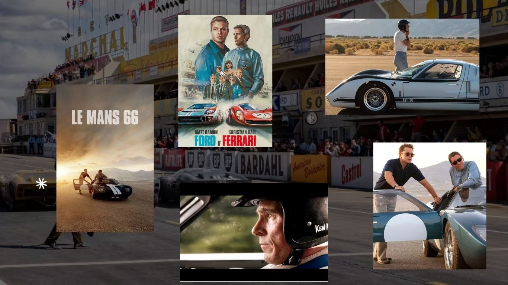
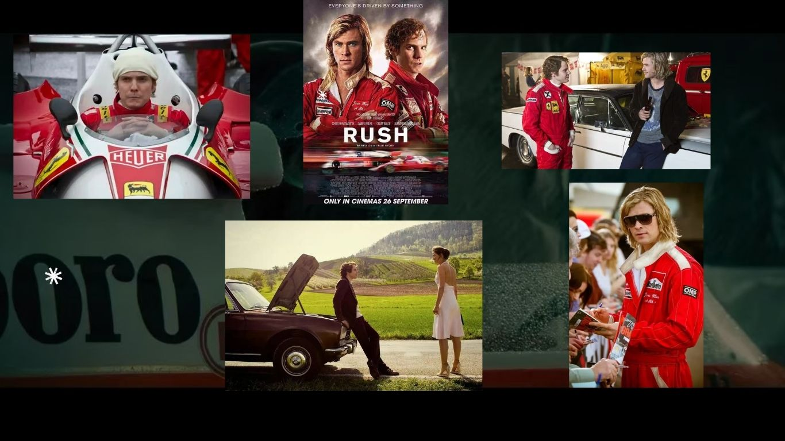
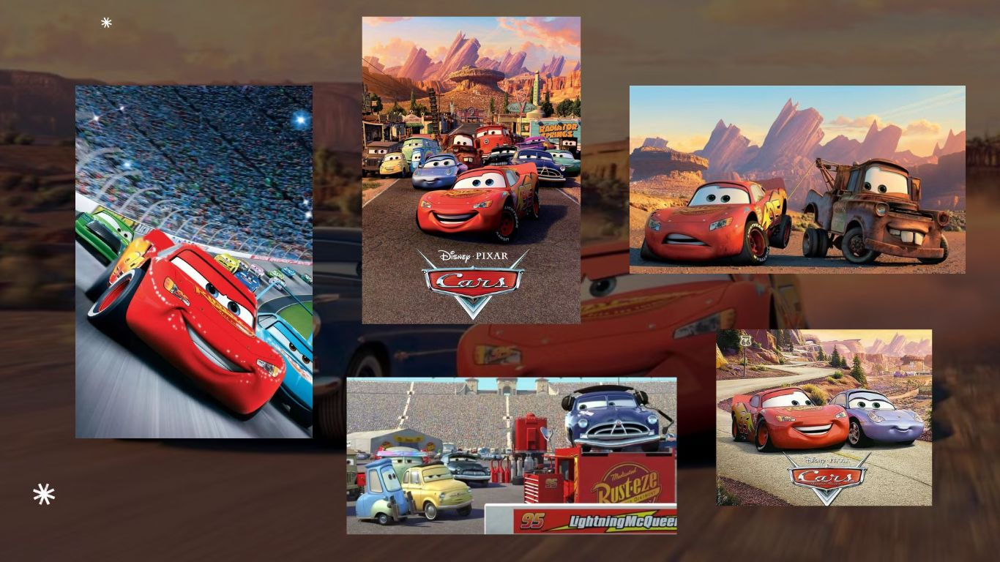

## 🎦Trailer

  <iframe 
    src="https://player.bilibili.com/player.html?bvid=BV1d9RkBmE3C&high_quality=1&danmaku=0" 
    style="position: absolute; top: 0; left: 0; width: 100%; height: 100%; border: none; outline: none;" 
    frameborder="0" 
    scrolling="no" 
    allowfullscreen>
  </iframe>

## F1 （2025）
 Directed by Joseph Kosinski

Sonny Hayes was once the most promising rookie on the F1 circuit, but an accident cut his career short, branding him as a "what could have been" tragedy. Thirty years later, Hayes is a down-and-out freelance racer when his former teammate, Rubén Cervantes, a struggling team owner on the brink of bankruptcy, comes to him with an offer. Cervantes convinces Hayes to return to F1 to save his team and to prove that Hayes still has what it takes to compete at the highest level. Paired with rising star Joshua Pearce, Hayes must face the ghosts of his past while learning that in F1, teammates can also be your fiercest rivals and that redemption is never a solo drive.

[grid]

[/grid]

## PEGASUS 2 (2024)
 Directed by Han Han

Five years ago, legendary racer Zhang Chi won the treacherous Bayinbrook rally but lost everything. His victory was nullified when the official lead seal was never found. Now scraping by running a failing driving school and hounded by online trolls, he has hit rock bottom. Then an unexpected phone call reignites his passion. Zhang Chi, a struggling car factory owner who happens to be his biggest fan, and a group of misfits including a gifted young driver, a washed up co-driver, a mechanic, and a hopeless student band together for one last shot at Bayinbrook. But the road to redemption is paved with idealism, cynicism, and the ghosts of a past that refuses to let go. Pegasus 2 is a story about fatherhood, failure, and the desperate hope of reclaiming dignity through one final race.

[grid]

[/grid]

## Ford v Ferrari (2019)
 Directed by James Mangold

Based on the true story of the 1966 24 Hours of Le Mans, this film follows automotive designer Carroll Shelby and driver Ken Miles as they battle corporate interference, engineering limits, and their own demons to build a revolutionary race car for Ford. At its core, it is a story about friendship, integrity, and the cost of staying true to oneself.

[grid]

[/grid]

## RUSH (2013)
 Directed by Ron Howard

Set against the golden era of Formula 1, Rush dramatizes the legendary rivalry between the calculating, disciplined Niki Lauda and the flamboyant, instinctive James Hunt. Beyond the crashes and championships, the film asks a deeper question: what does it truly mean to be brave?

[grid]

[/grid]

## Cars (2006)
 Directed by  John Lasseter
 
An arrogant rookie race car, Lightning McQueen, is on the fast track to fame until he gets stranded in a forgotten town on Route 66. With no fancy pit crew and no media attention, he is forced to work alongside the town's quirky residents. Through unexpected friendships and a slow-paced world he never bothered to see, McQueen learns that trophies are not the only measure of success. Cars speaks to audiences of all ages about humility, community, and the joy of slowing down.

[grid]

[/grid]
